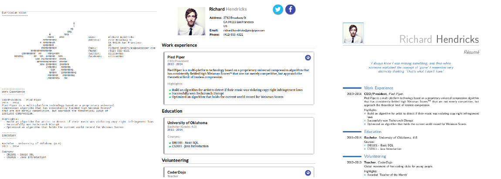

govitae
======

Render résumés with Go. Write it once and render it on the Go.

Current status
-------------

- [x] schema implemented
- [x] JSON parser working
- [x] YAML parser working
- [x] text output working
- [x] Latex output working
- [x] HTML output working
- [] better default install for templates and examples
- [] binary versions

What it does
-----------

Write your cv once in JSON or YAML and have it rendered by govitae in various formats:

- a nice looking web page
- a minimal but stylish text version
- a good looking Latex version which you can compile to pdf

The text, HTML and pdf version look something like this:


How to install and use
--------------------

For now you can install a development version, meaning you need to 
[install Go](https://golang.org/doc/install). After installing and setting
your $GOPATH and (if you want to your bin) for instance with

```bash
export GOPATH=$HOME/code/go
export PATH=$PATH:$HOME/code/go/bin
```

you can get govitae with

```go
go get github.com/cdiener/govitae
go install github.com/cdiener/govitae
```

Use the `resume.{yaml,json}` or `minimal.{yaml,json}` as a starting point to build your
own and render with

```go
govitae resume.yaml
```

In order to compile the Latex version you will need the moderncv package. It comes
with most "extra" packages for the Latex environment. This will allow you to generate
the PDF with

```bash
pdflatex resume.tex
```
